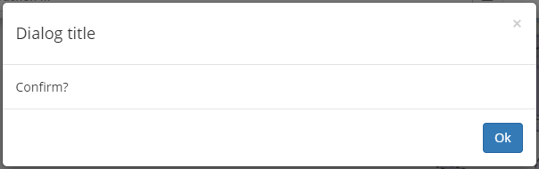

# lit-dialog
A simple webcomponent dialog using bootstrap's modal classes
  
Example  
  
1. Define your dialog:  

```javascript
import { html } from 'lit-html';
import { LitDialog } from 'lit-dialog';

export class ConfirmDialog extends LitDialog {

    renderContent() {
        return html`
            <div class="modal-header">
                <button type="button" class="close" data-dismiss="modal" aria-label="Close"><span aria-hidden="true">&times;</span></button>
                <h4>Dialog title</h4>
            </div>
            <div class="modal-body">
                <span>Confirm?</span>
            </div>
            <div class="modal-footer">
                <button type="button" class="btn btn-primary" @click="${e => this.ok()}">
                    <span>Ok</span>
                </button>
            </div>            
        `;
    }

    ok() {
        this.resolve('ok');
    }

}

customElements.define('confirm-dialog', ConfirmDialog);
```  
  
2. Use it:
  
```javascript
await result = new ConfirmDialog().open();
```
  
Result:  
  

